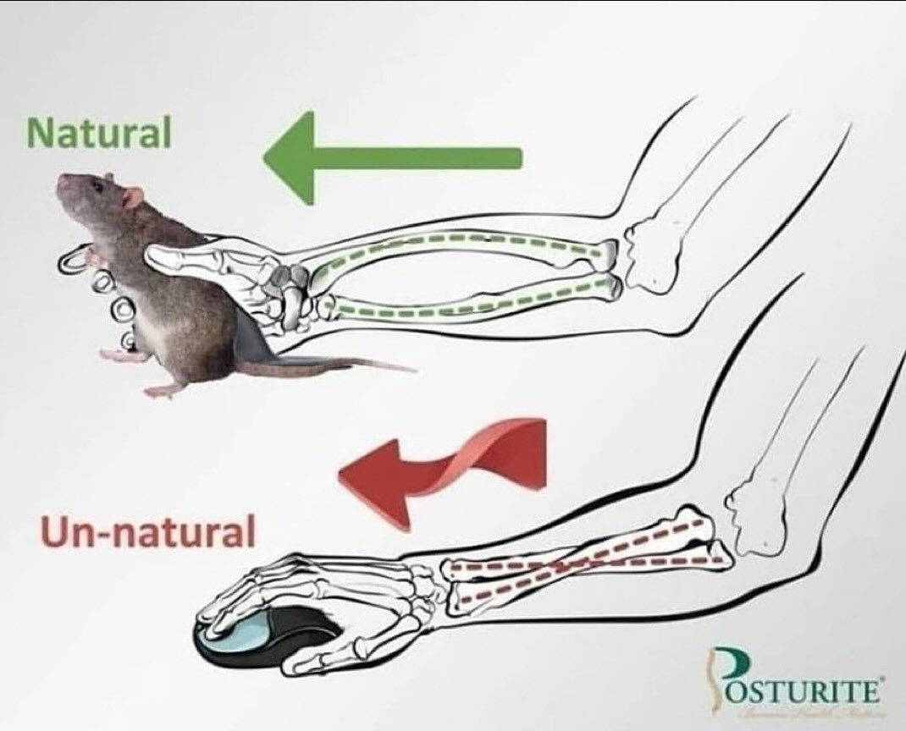
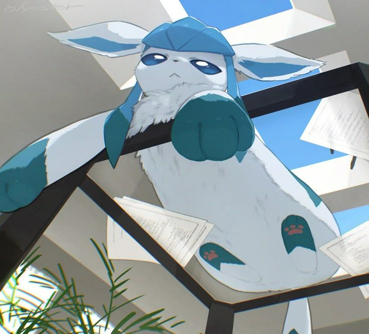
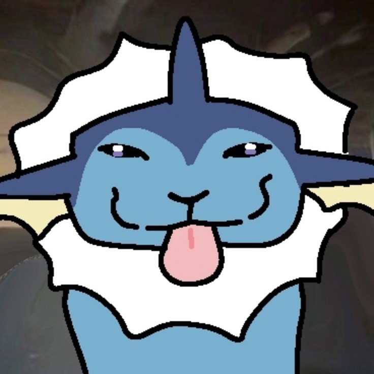

<p align="center">A passionate system engineering student & developer from Colombia 🌎</p>
<p align="center">Building cool things, sharing knowledge and solving real-world problems with code.</p>

<div align="center">
  <a href="https://wakatime.com/@ema28pro"></a>
  

  
  
  
</div>


<!--  -->

## **About Me**: 
<p>
  I am a System Engineering student, currently halfway through my degree. Passionate about Computer Science, Algorithmst, i am expanding my knowledge in both Front-end and Back-end development, and I am improving my skills. I love to learn and build something new, productive, innovative and creative.
</p>

<table align="right">
<tr><td><a href="./README.md">English</a></tr></td>
<tr><td><a href="./README_es.md">Spanish</a></tr></td>
</table>

🧠 Solving problems on CodinGame (Clash of Code) <br>
🤝 Looking to collaborate on open source projects <br>
💻 Coding with a Systems Engineer mindset <br>
💬 Ask me about anything, I am happy to help and talk <br>
📫 Reach out to me at: [ema2805pro@gmail.com](ema2805pro@gmail.com) <br>
<!-- ⚡ **Fun fact**: ```Nan != Nan``` -->

<!-- <div align="center">
  
</div> -->

---

<a href="https://github.com/ema28pro">

</a>

### 🛠 &nbsp;Tech Stack

<!--  -->
[](https://www.w3schools.com/html)
[](https://www.w3schools.com/css/)
[](https://www.w3schools.com/Js)
[](https://nodejs.org)
[](https://react.dev/)
[](https://tailwindcss.com/)

[](https://www.python.org/)&nbsp;
[](https://fastapi.tiangolo.com/)&nbsp;
<a href="https://numpy.org/" ></a>&nbsp;&nbsp;&nbsp;
[](https://www.java.com/)&nbsp;&nbsp;&nbsp;
[](https://www.learncpp.com/)


### 🗃 &nbsp;Others
[](https://www.mongodb.com/)&nbsp;
[](https://www.mysql.com/)&nbsp;&nbsp;&nbsp;
[](https://git-scm.com/)&nbsp;
[](https://github.com/)&nbsp;
[](https://code.visualstudio.com/)&nbsp;
[](https://www.notion.com/)&nbsp;
[](https://obsidian.md/)&nbsp;
<a href="https://trello.com/"></a>
<!-- https://www.tutorialspoint.com/fastapi -->
<!-- https://www.datacamp.com/es/tutorial/introduction-fastapi-tutorial -->
<!-- https://www.w3schools.com/cpp/cpp_intro.asp  -->
<!-- https://www.codecademy.com/learn/learn-c-plus-plus -->

<!-- <a href="https://github.com/ema28pro">

</a> -->

<h3> Connect with me:</h3>

<a style="margin-left: 10px;"  target="_blank" href="https://www.linkedin.com/in/emanuel-lopez-f/"></a> <a style="margin-left: 10px;" target="_blank" href="https://github.com/ema28pro"></a><a style="margin-left: 10px;"  target="_blank" href="https://www.codingame.com/profile/1b0126a833946858dc2f521afb4de4389706666"></a>

---

<div align="center">
  
</div>

> “If you can't explain it simply, you don't understand it well enough.” – Einstein

<br>

<table align="center">
<tr>
<td align="center">
  
</td>
<td align="center">
  
  <br/>
  
</td>
</tr>
</table>

<a href="https://www.codingame.com/profile/1b0126a833946858dc2f521afb4de4389706666"></a>

### 🚀 Current Focus

- 🌐 Mastering JavaScript fundamentals and DOM manipulation
- 🛠 Working on a Real-Time Chat app with Express.js
- 🌱 Learning React JS + TailwindCSS ⚡
- 🔭 Exploring AI fundaments and neural networks
- 🎯 Building Apps and Games

> “If it doesn’t exist yet, I’ll try until it does.”

---

<div align="center">
  
  
  
</div>

---

### 🤝 Let's talk

<table align="right">
  <tr><td>Build to grasp</tr></td>
  <tr><td>Boost through sharing</tr></td>
  <tr><td>Bond to enhance</tr></td>
</table>

📬 I like to collaborate and share ideas. You can write to me if:
- You want to **develop something together**
- You're interested in learning **programming**
- You have questions about **anything technical**

<details align="right">
  <summary></summary>
  <table border=0>
    <caption><h1 align="center">Hall of Fame</h1></caption>
    <tr>
    <td align="center">
      
    </td>
    <td align="center">
      
    </td>
    <td align="center">
      
    </td>
    </tr>
  </table>
</details>

<sub align="center">Made with patience and code ☕ — Always learning something new.</sub>
