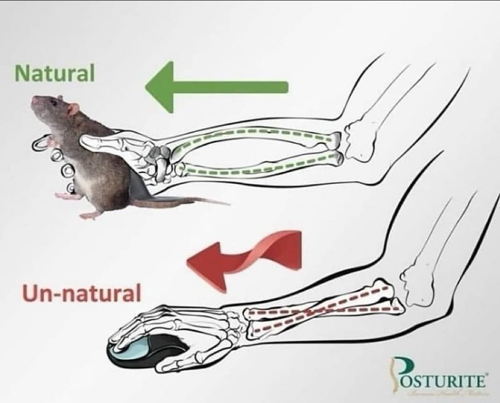

Estudiante y desarrollador colombiano apasionado por la ingeniería de sistemas 🌎

Desarrollando cosas innovadoras, compartiendo conocimientos y resolviendo problemas reales con código.

  
  
  

  
  
  

<!--  -->

## **Sobre Mi**: 

Soy estudiante de Ingeniería de Sistemas y estoy a mitad de mi carrera. Me apasiona el código. Sigo profundizando mis conocimientos en desarrollo Backend, construyendo proyectos y herramientas. También comparto lo que aprendo como tutor de programación, matemáticas y cálculo en mi universidad. Me gusta enfrentarme cada día a un reto nuevo, ya sea con algoritmos, estructuras de datos u optimización.

<table align="right"><tr><td><a href="./README_es.md">Español</a></tr></td><tr><td><a href="./README.md">Inglés</a></tr></td></table>

⚡ ¿Que puedes enseñarme?  
🧠 Resolviendo problemas de programación 
🤝 Buscando proyectos open-source para colaborar  
💻 Programando con mentalidad de ingeniero de sistemas  
💬 Pregúntame cualquier cosa; estaré encantado de ayudarte y conversar.  
📫 Contáctame en: [ctrl.ema28@gmail.com](ctrl.ema28@gmail.com)  

<b>Click me</b>

 

<table><tr><td valign="top" width="33%">

<h3>Recent Projects</h3>

  
[obsidian-skip-silence](https://github.com/ema28pro/obsidian-skip-silence) — plugin with custom silence & video speed controls to skip dead time and streamline note-taking  

[discord-plugin-photoshop-2020](https://github.com/ema28pro/discord-plugin-photoshop-2020) — CEP extension + Node.js bridge to display real-time Photoshop canvas details, layer stats, and activity on Discord  

[manga-downloaders](https://github.com/ema28pro/manga-downloaders) — Tampermonkey userscripts to download manga chapters into ZIPs  

[agente-inventario-mercado-central](https://github.com/ema28pro/agente-inventario-mercado-central) — LangChain Pandas DataFrame Agent + Gemini to query supermarket Excel inventories in natural language  

</td><td valign="top" width="34%">

<h3>TIL</h3>

`NaN != NaN` — why IEEE 754 breaks reflexive equality  

`a[i] == i[a]` — pointer arithmetic commutativity in C `*(a + i)`  

`OffscreenCanvas` — background graphics processing without freezing UI  

`Lost in the Middle` — why LLMs lose attention in the center of long contexts  

`Discord RPC` — currently obsessed with Discord Rich Presence  

</td><td valign="top" width="33%">

<h3>Algorithms Problems</h3>

[CodinGame](https://www.codingame.com/profile/1b0126a833946858dc2f521afb4de4389706666)  

</td></tr></table>

---

### 🛠 &nbsp;Stack Tecnológico

<!--  -->

&nbsp;
&nbsp;
&nbsp;&nbsp;&nbsp;
&nbsp;&nbsp;&nbsp;

### 🗃 &nbsp;Otros
&nbsp;
&nbsp;&nbsp;&nbsp;
&nbsp;
&nbsp;
&nbsp;
&nbsp;
&nbsp;

<!-- https://www.tutorialspoint.com/fastapi -->
<!-- https://www.datacamp.com/es/tutorial/introduction-fastapi-tutorial -->
<!-- https://www.w3schools.com/cpp/cpp_intro.asp  -->
<!-- https://www.codecademy.com/learn/learn-c-plus-plus -->

<!--  -->

<h3> Conecta conmigo:</h3>

---

  

> “Si no puedes explicarlo de forma sencilla, es que no lo entiendes bien.” – Einstein

 

<table align="center">
<tr>
<td align="center">
  
</td>
<td align="center">
  
   
  
</td>
</tr>
</table>

### 🚀 Enfoque actual

- 🌐 Profundizando en desarrollo Backend y diseño de APIs
- 🤖 Experimentando con RAG y automatizaciones
- 🧩 Explorando la teoría de autómatas
- 💾 Dominando la programación en C
- 🧬 Aprendiendo Machine Learning
- 🎮 Desarrollando videojuegos

> "Si aún no existe, lo intentaré hasta que exista".

---

  

---

### 🤝 Hablemos

<table align="right">
 <tr><td>Construyo para entender</td></tr>
 <tr><td>Comparto para reforzar</td></tr>
 <tr><td>Colaboro para mejorar</td></tr>
</table>

📬 Me gusta colaborar y compartir ideas, puedes escribirme si:
  - Quieres **desarrollar algo juntos**
  - Te interesa aprender **programación**
  - Tienes dudas sobre **cualquier cosa técnica**

  

  <table border=0>
    <caption><h1 align="center">Hall de la Fama</h1></caption>
    <tr>
    <td align="center">
      
    </td>
    <td align="center">
      
    </td>
    <td align="center">
      
    </td>
    </tr>
  </table>

Hecho con paciencia y código ☕ — Siempre aprendiendo algo nuevo.
