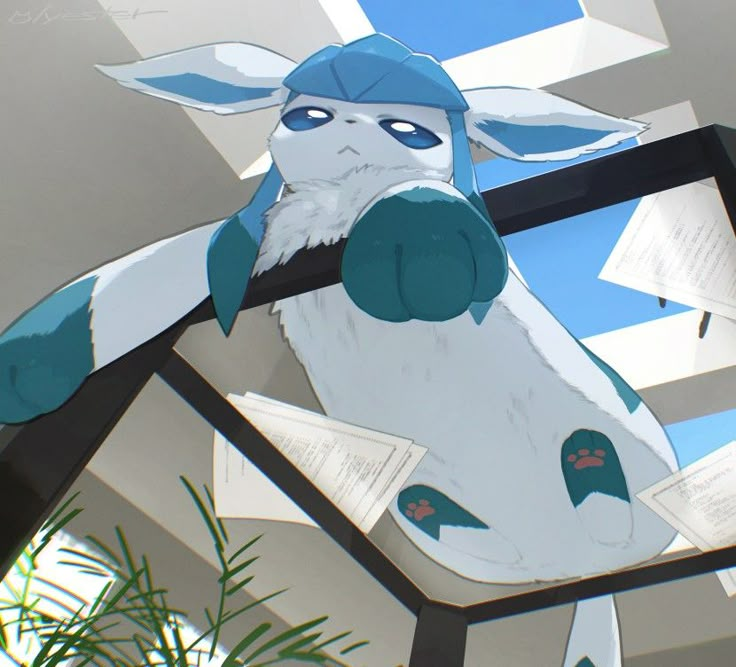

<p align="center">Estudiante y desarrollador colombiano apasionado por la ingeniería de sistemas 🌎</p>
<p align="center">Desarrollando cosas innovadoras, compartiendo conocimientos y resolviendo problemas reales con código.</p>

<div align="center">
  <a href="https://wakatime.com/@ema28pro"></a>
  

  
  
  

  
</div>

<!--  -->

## **Sobre Mi**: 

<p>
Soy estudiante de Ingeniería de Sistemas y estoy a mitad de mi carrera. Me apasiona la informática y los algoritmos, y estoy ampliando mis conocimientos en desarrollo front-end y back-end, mejorando mis habilidades. Me encanta aprender y crear algo nuevo, productivo, innovador y creativo.
</p>

<table align="right"><tr><td><a href="./README_es.md">Español</a></tr></td><tr><td><a href="./README.md">Ingles</a></tr></td></table>

🧠 Resolviendo problemas en CodinGame (Clash of Code) <br>
🤝 Busco colaborar en proyectos de código abierto <br>
💻 Programando con mentalidad de ingeniero de sistemas <br>
💬 Pregúntame cualquier cosa; estaré encantado de ayudarte y conversar. <br>
📫 Contáctame en: [ema2805pro@gmail.com](ema2805pro@gmail.com) <br>

<!-- ⚡ **Facto**: ```Nan != Nan``` -->

<!-- <div align="center">
  
</div> -->

---

<a href="https://github.com/ema28pro">

</a>

### 🛠 &nbsp;Stack Tecnológico

<!--  -->


&nbsp;
&nbsp;
&nbsp;&nbsp;&nbsp;
&nbsp;&nbsp;&nbsp;


### 🗃 &nbsp;Otros
&nbsp;
&nbsp;&nbsp;&nbsp;
&nbsp;
&nbsp;
&nbsp;
&nbsp;
&nbsp;


<!-- <a href="https://github.com/ema28pro">

</a> -->

<h3> Conecta conmigo:</h3>

<a style="margin-left: 10px;"  target="_blank" href="https://www.linkedin.com/in/emanuel-lopez-f/"></a> <a style="margin-left: 10px;" target="_blank" href="https://github.com/ema28pro"></a>

---

<div align="center">
  
</div>

> “Si no puedes explicarlo simple, no lo entiendes lo suficiente.” – Einstein

<br>

<table align="center">
<tr>
<td align="center">
  
</td>
<td align="center">
  
  <br/>
  
</td>
</tr>
</table>

<a href="https://www.codingame.com/profile/1b0126a833946858dc2f521afb4de4389706666"></a>

### 🚀 Enfoque actual

- 🌐 Dominar los fundamentos de JavaScript y la manipulación del DOM
- 🛠 Trabajando en una app de chat en tiempo real con Express.js
- 🌱 Aprendiendo React JS + TailwindCSS ⚡
- 🔭 Explorando los fundamentos de la IA y las redes neuronales
- 🎯 Desarrollar apps y juegos

> "Si aún no existe, lo intentaré hasta que exista".

---

<div align="center">
  
</div>

---

### 🤝 Hablemos

<table align="right">
 <tr><td>Construyo para entender</td></tr>
 <tr><td>Comparto para reforzar</td></tr>
 <tr><td>Colaboro para mejorar</td></tr>
</table>

📬 Me gusta colaborar y compartir ideas, puedes escribirme si:
  - Quieres **desarrollar algo juntos**
  - Te interesa aprender **programación**
  - Tienes dudas sobre **cualquier cosa técnica**

<details align="right">
  <summary></summary>
  <table border=0>
    <caption><h1 align="center">Hall de la Fama</h1></caption>
    <tr>
    <td align="center">
      
    </td>
    <td align="center">
      
    </td>
    <td align="center">
      
    </td>
    </tr>
  </table>
</details>

<sub align="center">Hecho con paciencia y código ☕ — Siempre aprendiendo algo nuevo.</sub>
