```

```

<table align="right">
 <tr><td><a href="README.md">English</a></td></tr>
 <tr><td><a href="README_es.md">Español</a></td></tr>
</table>

<details>
  <summary></summary>&nbsp;

  &nbsp;

  &nbsp;

  
</details>

# Linkeado

| Columna 1 | Columna 2 | Columna 3 |
|-----------|-|---------------------|
| hola      | adios | XDXDXDXDXDXDX |

<table>
<tr>
<th> Good </th>
<th> Bad </th>
</tr>
<tr>
<td>

```c++
int foo() {
    int result = 4;
    return result;
}
```

</td>
<td>

```c++
int foo() { 
    int x = 4;
    return x;
}
```

</td>
</tr>
</table>

Este es el primer párrafo con un \
salto de línea.

<div align="center">

[![Tailwind Components][logo-url]][site-url]  

</div>

[Aqui se linkeo](#linkeadopyoneerC)

[logo-url]: ""
[site-url]: ""

```mermaid
graph LR
    A[🎓 Computer Engineering Student] --> B[👨‍💻 Web Developer Jr.]
    B --> C[Vue.js Expert]
    B --> D[GraphQL Specialist]
    B --> E[Scrum Master]
    C --> F[🎨 UI/UX Implementation]
    D --> G[🔄 API Architecture]
    E --> H[📋 Project Management]
    
    style A fill:#ff6b35,stroke:#ff3d00,stroke-width:3px,color:#fff
    style B fill:#ff3d00,stroke:#e6340a,stroke-width:2px,color:#fff
    style C fill:#d42c00,stroke:#bf2700,stroke-width:2px,color:#fff
    style D fill:#bf2700,stroke:#a62200,stroke-width:2px,color:#fff
    style E fill:#a62200,stroke:#8d1d00,stroke-width:2px,color:#fff
```


